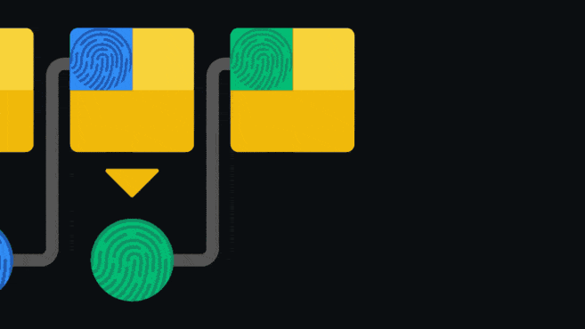

# Blockchain

## Table of contents
* [Node](#node)
* [Wallet](#wallet)

## Attention!
This is still very much a work in progress.

## General info
Blockchain



## Node
To use this project:
* A
* B
* C

Code:
  ```
    # .PCD v0.7 - Point Cloud Data file format
    -0.2881591 -0.9084934 7.9559093 389515
    ...........
  ```


## Wallet
* With the wallet you can:
    * A
    * B


