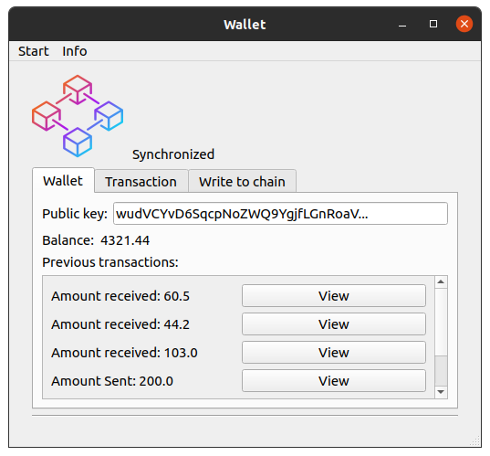

# Blockchain

## Attention!
This is still very much a work in progress.
The wallet generation is to be considered a toy example. 
Should not be used in any real applications in the current state.


## General info
This is PoW blockchain where both the code for the nodes and the wallet application
is in the same project. Multiple nodes can be started locally. 
The nodes will communicate transactions and new peers to each other.

<hr>

## Directories
* /node - Contains all the code for the node logic.
* /wallet -  Contains GUI files and the logic for sending tx to the network etc.
* /scripts - Some scripts to run nodes easily. Get them to sync to their peers etc.

## How to run

Run multiple nodes example:
```
#Starts 3 nodes.
bash start3

#Register them as peers to each other.
bash register.
 ```

Run /wallet/start.py to start the wallet application.

<hr>

## Wallet GUI
With the wallet you can:
* Send transactions.
* See your transaction history.




